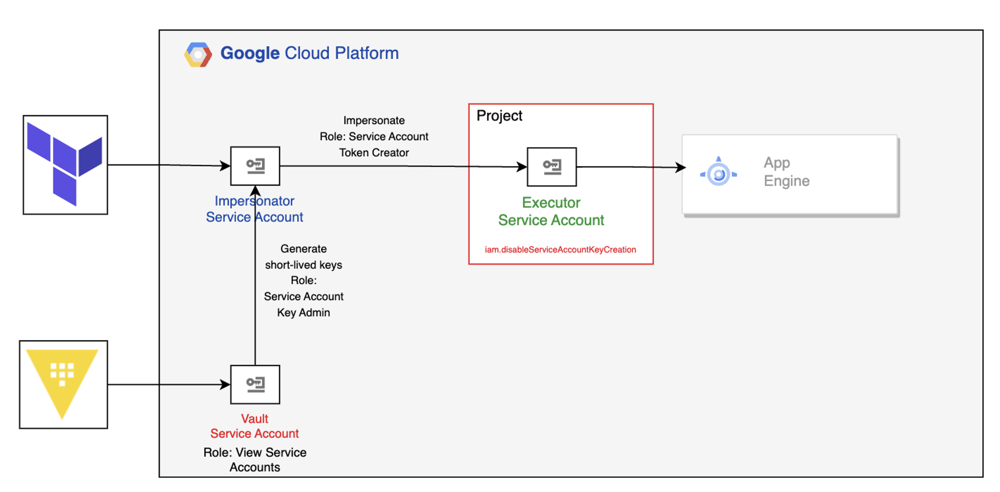

To setup Vault secret engine and static account, use the script *vault_setup.sh*. You will need the key from vault SA in JSON format.

Before running the script export *vault_token* var into an env variable

*export TF_VAR_vault_token='${TOKEN}'*

